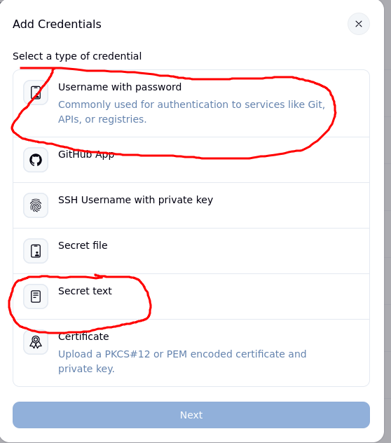
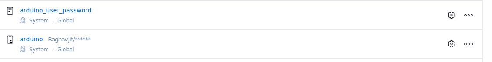

# Jenkins Groovy Script Explained

## Additional Docs
1. [Steps to make a pipeline](./Docs_JenkinsPipeline.md)
1. [Jenkins Troubleshooting](./Docs_JenkinsAdditional.md#future-scope-and-limitations)
2. [Future scope and limitations](./Docs_JenkinsAdditional.md#jenkins-troubleshooting)
3. [Jenkins User accounts configuration](./Docs_JenkinsAdditional.md#jenkins-user-accounts-configuration)

## Credentials

These are secrets stored in Jenkins and accessed in the pipeline via the `environment {}` block.
To manage them, navigate to **Settings → Credentials**.

We use two types of credentials:

1. **Username and Password**
   The GitHub PAT is stored as:

   * **Username:** GitHub username
   * **Password:** Personal Access Token (PAT)

2. **Secret Text**
   Used for items such as the MySQL password for a site's database.




---

## Naming Conventions

The following conventions ensure consistency and prevent conflicts across deployments.
All names must follow the patterns below.

| Item                               | Convention                                                    | Example                                      | Notes                                                                                       |
| ---------------------------------- | ------------------------------------------------------------- | -------------------------------------------- | ------------------------------------------------------------------------------------------- |
| **Site Name**                      | A single lowercase word with no numbers or special characters | `arduino`, `openplc`, `freecad`, `osdag`     | All derived names use this as the base.                                                     |
| **GitHub PAT Credential**          | `<site-name>`                                                 | `arduino`                                    | Stores GitHub PAT as Username/Password.                                                     |
| **Database Password Credential**   | `<site-name>_user_password`                                   | `arduino_user_password`                      | Secret Text credential.                                                                     |
| **Database Username**              | `<site-name>_user_jenkins_<4-digit-number>`                   | `arduino_user_jenkins_1023`                  | The number distinguishes users from older deployments.                                      |
| **Database Name**                  | `<site-name>_db_jenkins_<deployment-number>`                  | `arduino_db_jenkins_17`                      | Deployment number is given by Jenkins. Ensures we always target the newest DB.              |
| **Dumpfile Name**                  | `<site-name>_<drupal-version>.sql`                            | `arduino_7.sql`                              | Helps SysAdmin verify Drupal version during deployment. Developers must set this correctly. |
| **Git Branch**                     | Always use `main`                                             | `main`                                       | Never use `master`.                                                                         |
| **Podman Secrets**                 | `<site-name>_mysql_db` and `<site-name>_mysql_password`       | `arduino_mysql_db`, `arduino_mysql_password` | Stored and consumed by Podman.                                                              |
| **Image and Container Name**       | Image: `<site-name>_image`                                    |                                              |                                                                                             |
| Container: `<site-name>_container` | `arduino_image`, `arduino_container`                          | Applied consistently across all deployments. |                                                                                             |
| **Uploads and Public Directory**   | `<site-name>_uploads` and `<site-name>_public`                | `arduino_uploads`, `arduino_public`          | Mounted into the container.                                                                 |


Here is the **grammar- and spelling-corrected version**, with **no paraphrasing**, **no shortening**, and **no missed full stops**.

---

## Stagewise Explanation

The Groovy script is divided into multiple stages. Each stage performs an atomic task. All the stages are in the `pipeline` block.

### Stage - environment [1/12]

This stage sets the values of variables we will be using throughout the script. Credentials and secrets are imported from Jenkins here. The reason why I did not use variables for site-name and port is because the escaping was becoming difficult, and sometimes they would start using literal strings instead of variables, like $SITENAME being interpreted as "$SITENAME" instead of arduino due to complicated string escaping. This can be improved in the future if a clean method is found to handle all layers of escaping correctly.

```
environment {
    ROOTPASS        = credentials('mysql')
    SITE_DB_USER    = 'arduino_user_jenkins_1396' 
    SITE_DB_PASSWD  = credentials('arduino_user_password')
}
```

### Stage - parameters [2/12]

Defining parameters directly in the script is important because relying on the Jenkins GUI for parameters is not ideal. If a new pipeline is created or the same script is reused in another job, the parameters added manually through the GUI must be recreated every time. This is slow, error-prone, and easy to overlook. Keeping parameters inside the script ensures the pipeline is self-contained and behaves consistently everywhere without depending on external GUI configuration.

**UPDATE_PUBLIC**: the problem comes from how the public folder is mounted. The \<site-name>_public folder (for example, arduino_public) is mounted into the container at sites/default/files. Because of this mount, the content inside the container at sites/default/files is completely replaced by whatever exists in the mounted folder. This means any content uploaded by developers through the Drupal web interface lives inside the running container, but does not exist in arduino_public.

When a new build happens, the image is built from the repository. If the repository’s sites/default/files directory does not include the new content uploaded by developers, that content gets wiped out, and only whatever exists in arduino_public becomes visible inside the container after the mount. Therefore, to preserve developer-uploaded content, that data must be copied out to the mounted folder before the next build. This ensures that the mounted directory remains the correct source of truth, and no uploaded content disappears simply because the repository had an older or empty version of the folder.

Default value of UPDATE_PUBLIC will be mentioned under ``defaultValue:``

**ENVIRONMENT**: When value of this variable is DEVELOPMENT the database and secrets are deleted and created again, otherwise we just reuse them from previous build. We did this because in development phase the content might get updated from developer side via SQL dumps (which we pull and use) but in production mode developers promise to stop making changes, and only the server side database is assumed to be latest, so developer's SQL dump is no longer used, as it may not be the latest.

Default value of ENVRIONMENT variable: The first value in the ``choices`` array is the default value.

```
parameters {
    booleanParam(
        name: 'UPDATE_PUBLIC',
        defaultValue: true,
        description: 'Select when new content is added in site/default/files directory of GitHub repository.<br>When true this will copy the contents to the container.'
    )

    choice(
        name: 'ENVIRONMENT',
        choices: ['DEVELOPMENT', 'PRODUCTION'],
        description: 'PRODUCTION: Reuse existing database and mounted folders<br>DEVELOPMENT: Create fresh database and mount empty folders'
    )
}
```

### Stage - Stop site [3/12]

At the end of the build we create a systemd service using Podman pods (Podman systemd-generate script is depricated and should be avoided). This helps restart the container in case it crashes or stops. The container is started by a systemd service, if the service stops container stops. This makes container management tied with systemd easier. Please note that this systemd service is specific to Jenkins users and not a global systemd service. You may also notice that we export some variables before executing these services, if we do not do that we get missing DBUS error.

```
stage ('Stop site') {
    steps {
        sh ''' 
            export XDG_RUNTIME_DIR="/run/user/$(id -u)"
            export DBUS_SESSION_BUS_ADDRESS="unix:path=\${XDG_RUNTIME_DIR}/bus"

            systemctl --user disable arduino.service || true
            systemctl --user stop arduino.service || true
        '''
    }
}
```

### Stage - Clone repo [4/12]

In this stage we clone the public repo that contains the code for the Drupal site, since the repo is public we do not need any GitHub PATs to access it. However this may be added in the future the same way we have added it for SQL dump repo. Previously mentioned copying of site/default/files content to `<site-name>_public` folder is done here.

```
stage('Clone Repo') {
    steps {
        dir('arduino_repo') {
            checkout scmGit(
                branches: [[name: '*/main']], 
                extensions: [], 
                userRemoteConfigs: [[url: 'https://github.com/FOSSEE/arduino10_drupal_docker']]
            )
        }

        script {
            if (params.UPDATE_PUBLIC) {
                sh '''
                    mkdir -p "$WORKSPACE/../../site_directories/arduino_public/"
                    mkdir -p "$WORKSPACE/../../site_directories/arduino_uploads/"
                    
                    if [ -d "arduino_repo/sites/default/files" ]; then
                        cp -r arduino_repo/sites/default/files/. "$WORKSPACE/../../site_directories/arduino_public/"
                    else
                        echo "Source directory does not exist"
                    fi
                '''
            } 
            else {
                echo "Content from site repo will not be copied to public dir of site."
            }
        }
    }
}
```

### Stage - Clone DB [5/12]
Here we clone the latest sql dump from the designated repo using Github creds mentioned above, in this example cred name is ``arduino``.
```
stage ('Clone DB') {
    steps {
        dir('arduino_db') {
            checkout scmGit(
                branches: [[name: '*/main']],
                userRemoteConfigs: [[ credentialsId: 'arduino', url: 'https://github.com/RaghavJit/arduino_db' ]]
            )
        }
    }
}
```

### Stage - Create Database [6/12]
As mentioned before this stage depends on the parameters passed duing the build time, ENVIRONMENT. 
the script wipes all existing Jenkins-generated databases matching the pattern arduino_db_jenkins_%, creates a fresh database for the current build number, ensures the database user exists with full privileges, and then imports a cleaned version of the SQL dump every time. This makes the development workflow fully destructive and resets the database on each run. In contrast, the production block performs no cleanup, creates the build-specific database only if it does not already exist, assigns user privileges in the same way, and imports the SQL dump only during the initial creation. This makes the production path non-destructive, preserving any existing data and avoiding repeated imports.
If values is DEVLEOPMENT we search the older database with the name \<site-name>_db_jenkins_% and delete everything, this may sometimes fail if the user (root) does not have privilage to the database, that's why we have the trailing build number in database name so even if we fail to delete it or for some reason choose to keep the older database, we can garuntee that newer database with larget numebr is used always
if value is production we reuse the older database.
```
stage('Create new MySQL DB') {
    steps {
        script {

            if (params.ENVIRONMENT == "DEVELOPMENT") {

                sh '''
                    set -e

                    db_list=$(mysql -u root -p"$ROOTPASS" --silent --skip-column-names \
                        -e "SHOW DATABASES LIKE 'arduino_db_jenkins_%';")

                    if [ -n "$db_list" ]; then
                        while IFS= read -r db; do
                            mysql -u root -p"$ROOTPASS" <<EOF
DROP DATABASE IF EXISTS $db;
EOF
                        done <<< "$db_list"
                        mysql -u root -p"$ROOTPASS" -e "FLUSH PRIVILEGES;"
                    fi

                    newdb="arduino_db_jenkins_${BUILD_NUMBER}"

                    mysql -u root -p"$ROOTPASS" <<EOF
CREATE DATABASE IF NOT EXISTS $newdb;
CREATE USER IF NOT EXISTS '$SITE_DB_USER'@'localhost' IDENTIFIED BY '$SITE_DB_PASSWD';
GRANT ALL PRIVILEGES ON $newdb.* TO '$SITE_DB_USER'@'localhost';
FLUSH PRIVILEGES;
EOF

                    if [ -f "arduino_db/arduino_10.sql" ]; then
                        sed -e '/^CREATE DATABASE/d' -e '/^USE[[:space:]]/d' \
                            arduino_db/arduino_10.sql > /tmp/arduino_clean.sql

                        mysql -u "$SITE_DB_USER" -p"$SITE_DB_PASSWD" "$newdb" < /tmp/arduino_clean.sql
                    fi
                '''
            }

            else {

                sh '''
                    set -e

                    prod_db="arduino_db_jenkins_${BUILD_NUMBER}"

                    exists=$(mysql -u root -p"$ROOTPASS" --silent --skip-column-names \
                        -e "SHOW DATABASES LIKE '$prod_db';")

                    if [ -z "$exists" ]; then
                        mysql -u root -p"$ROOTPASS" <<EOF
CREATE DATABASE $prod_db;
CREATE USER IF NOT EXISTS '$SITE_DB_USER'@'localhost' IDENTIFIED BY '$SITE_DB_PASSWD';
GRANT ALL PRIVILEGES ON $prod_db.* TO '$SITE_DB_USER'@'localhost';
FLUSH PRIVILEGES;
EOF

                        if [ -f "arduino_db/arduino_10.sql" ]; then
                            sed -e '/^CREATE DATABASE/d' -e '/^USE[[:space:]]/d' \
                                arduino_db/arduino_10.sql > /tmp/arduino_clean.sql

                            mysql -u "$SITE_DB_USER" -p"$SITE_DB_PASSWD" "$prod_db" < /tmp/arduino_clean.sql
                        fi
                    fi
                '''
            }

        }
    }
}
```

### Stage - Fetch Dockerfile [7/12]
In this step we clone the Dockerfile we need for building, we only clone the Dockerfile and not the entire repo. In this case we are donwloading Dockerfile for version 10, hence the path is ``Docker/10`` if we are building for drupal 11 path will be ``Docker/11``. To do this replace Dockerfile with Dockerfile.11 in all places except for the last instant. [See here](./Docs_JenkinsAdditional.md#stage---fetch-dockerfile-712)
```
stage ('Fetch Dockerfile') {
    steps {
        dir('dockerfile_only') {
            sh """
                    rm -rf .git
                    git init
                    git remote add origin https://github.com/FOSSEE-DevOps/RaghavDocumentation
                    git config core.sparseCheckout true
                    mkdir -p .git/info
                    echo "DrupalMigrate/files/Docker/10/Dockerfile" > .git/info/sparse-checkout
                    git pull origin master --depth=1
                    cp -r DrupalMigrate/files/Docker/10/Dockerfile "${WORKSPACE}/Dockerfile"
            """
        }
    }
}
```

### Stage - Build Image [8/12] 
This stage build the docker image with the cloned dockerfile, it also ensures that on previous dockerfiles of that site exist by deleting them.
```
stage ('Build Image') {
    steps {
        sh 'podman image ls --format "{{.Repository}}" | grep "^arduino" | xargs -r podman image rm'
        sh """
            podman build \
                -t arduino_image:latest \
                -f "${WORKSPACE}/Dockerfile" \
                --build-arg ENV_USR="arduino_user_jenkins_1396" \
                --build-arg REPO_DIR="arduino_repo" \
                --build-arg ENV_HOST="10.0.2.2" \
                "${WORKSPACE}"
        """
    }
}
```

### Stage - Podman Secrets [9/12]
[Podman secrets](https://docs.podman.io/en/latest/markdown/podman-secret-create.1.html) is a podman feature that helps us manage secrets like env vars. We can create podman secerts adn use them during building/running. Here we export those secrets as env vars to the container (More in next step).
```
stage('Podman Secrets') {
            steps {
                script {

                    if (params.ENVIRONMENT == "DEVELOPMENT") {
                        sh """
                            set -e

                            podman secret rm arduino_mysql_db || true
                            podman secret rm arduino_mysql_password || true

                            printf "arduino_db_jenkins_${BUILD_NUMBER}" | podman secret create arduino_mysql_db -
                            printf "${SITE_DB_PASSWD}" | podman secret create arduino_mysql_password -
                        """
                    }

                    else {
                        sh """
                            set -e

                            if ! podman secret inspect arduino_mysql_db >/dev/null 2>&1; then
                                printf "arduino_db_production" | podman secret create arduino_mysql_db -
                            fi

                            1. This is quite stable stage and has never failed if the above stages work fine. The only possible cause of failure might be trivial things like typos/missing packages etc.if ! podman secret inspect arduino_mysql_password >/dev/null 2>&1; then
                                printf "${SITE_DB_PASSWD}" | podman secret create arduino_mysql_password -
                            fi
                        """
                    }
                }
            }
        }
```

### Stage - Podman SystemD generator [10/12] 
Podman generates a systemd file to automatically start the contaienr and manage it as a service. We first create a ``.container`` file in ``~/.config/containers/systemd/arduino.container`` and reload systemd. This automatically generates a systemd file. The container file is like the recpie to create the container. This file however, does not have options to add env vars. To achieve this we run a ``sed`` command to insert env var values to the generated systemd script. Please notice how the cat command content has 0 indentation, same is true for SQL queries above, don't insert tabs in these parts as this will break the syntax.
```
stage ('Podman SystemD generator') {
            steps {
                script {
                    sh '''
                    set -e

                    echo "Exporing XDG and DBUS vars"
                    export XDG_RUNTIME_DIR="/run/user/$(id -u)"
                    export DBUS_SESSION_BUS_ADDRESS="unix:path=\${XDG_RUNTIME_DIR}/bus"

                    systemctl --user disable arduino.service || true
                    systemctl --user stop arduino.service || true

                    mkdir -p ~/.config/containers/systemd


                    cat > ~/.config/containers/systemd/arduino.container <<EOF
[Unit]
Description=arduino Persist Container
After=network-online.target
Wants=network-online.target

[Container]
Image=arduino_image:latest
Pull=never
AddCapability=NET_RAW
ContainerName=arduino_container
PublishPort=9102:80
Volume=/var/lib/jenkins/site_directories/arduino_public:/var/www/html/sites/default/files:Z
Volume=/var/lib/jenkins/site_directories/arduino_uploads:/var/www/html/arduino_uploads:Z
Network=slirp4netns:allow_host_loopback=true

[Service]
Restart=unless-stopped
TimeoutStartSec=1000

[Install]
WantedBy=default.target
EOF

                    systemctl --user daemon-reload || true

                    mkdir -p ~/.config/systemd/user
                    cp /run/user/$(id -u)/systemd/generator/arduino.service ~/.config/systemd/user/ || true

                    echo "Adding Podman Secrets to service file"
                    sed -i 's|podman run|podman run --secret arduino_mysql_db,type=env,target=ENV_DB --secret arduino_mysql_password,type=env,target=ENV_PSWD|' ~/.config/systemd/user/arduino.service
                    systemctl --user daemon-reload || true
                    systemctl --user enable arduino || true
                    systemctl --user start arduino || true
                    '''
                }
            }
        }
``` 

### Stage - Mail enable [11/12]
The Drupal site uses postfix configured on host as mail transfer agent, to be able to transfer mail to host's postfix the container needs some packages. This script also does some minor configuration needed for those packages to work well. Refer [MailConfig](./Docs_MailConfig.md) docs for more info.
```
stage('Mail enable') {
    steps {
        sh '''
            podman exec arduino_container apt update
            podman exec arduino_container apt install mailutils ssmtp -y
            
            podman exec arduino_container sh -c 'echo "mailhub=10.0.2.2:25" > /etc/ssmtp/ssmtp.conf'
            podman exec arduino_container sh -c 'echo "root:root@fossee.org.in:10.0.2.2:25" >> /etc/ssmtp/revaliases'
            podman exec arduino_container sh -c 'echo "'${ENV_USR}':'${ENV_USR}'@fossee.org.in:10.0.2.2:25" >> /etc/ssmtp/revaliases'
        '''
    }
}
```

### Stage - Set Permissions [12/12]
Final step is to make sure all file/mounts have necessary and sufficient permissions. We achieve this using a bash script hosted on our servers. After that we take some corrective steps and loosen the permissions for mounted folders. Refer [permissions and lables docs](./Docs_Folder_Permission.md)
```
stages {
    stage('Set Permissions') {
        steps {
            sh '''
                podman exec arduino_container sh -c 'curl -s https://static.fossee.in/IT/drupal_fix_permissions.sh | bash -s -- -u="arduino_user_jenkins_1396"'
                podman exec arduino_container sh -c 'chown -R root:www-data /opt/drupal/sites/default/files'
                podman exec arduino_container sh -c 'chown -R root:www-data /opt/drupal/arduino_uploads'
                podman exec arduino_container sh -c 'chmod -R 770 /opt/drupal/sites/default/files'
                podman exec arduino_container sh -c 'chmod -R 770 /opt/drupal/arduino_uploads'
            '''
        }
    }
}
```

