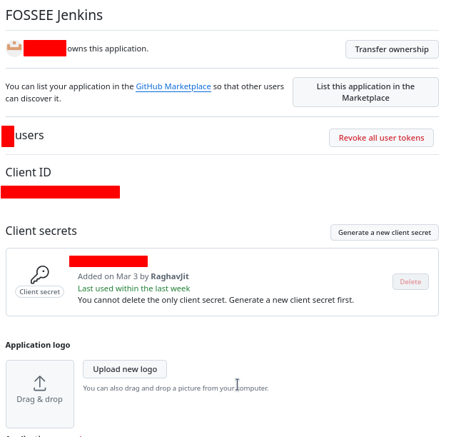
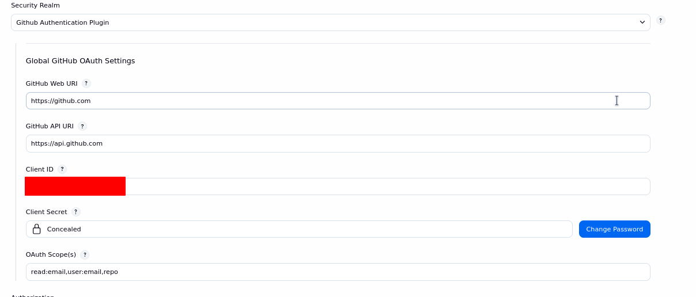
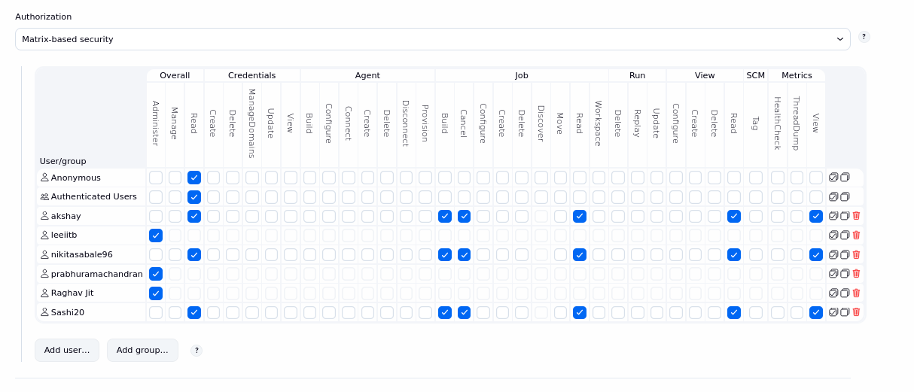

# Additional Docs

## Jenkins Troubleshooting
Common errors during site building (Stage vise)

### Stage - environment [1/12]
1. Missing or deleted credentials. (Cloneing and Database import stage will fail)
    - Ensure the credential's spelling are correct.
    - Ensure credential values are correct.

1. Incorrect or outdated ROOTPASS. 
    - Make sure if we change it on odin we change it on jenkins also. (Database import stage will fail)

### Stage - parameters [2/12]
1. UPDATE_PUBLIC: Sometimes we may get and error on ``cp`` in clone and copy of public folder. 
    - If this happens unset (set false) the  UPDATE_PUBLIC variable and build again, then set it true and build one final time.
    
### Stage - Stop site [3/12]
1. Jenkins user does not have a shell by default, so the DBUS error message may appear when tring to use ``systemctl``. 
    - Solution: export these variables.
        ```
        export XDG_RUNTIME_DIR="/run/user/$(id -u)"
        export DBUS_SESSION_BUS_ADDRESS="unix:path=\${XDG_RUNTIME_DIR}/bus"
        ```

### Stage - Clone Repo [4/12]
1. Repository moved/renamed
2. If UPDATE_PUBLIC is true, sometime ``cp`` of public folder from cloned site to \<site-name>_public may fail.
    - Build with UPDATE_PUBLIC as false, then build again with UPDATE_PUBLIC as true.

### Stage - Clone DB [5/12]
1. Incorrect name for ``.dump`` file. There could be a typo in name of dump file.
    - Correct the name in db dump repo and build again.
2. Faulty/Corrupted dumpfile (Database import stage will fail) and will give "The website encountered an unexpected error. Try again later."
    - Let the site build, then delete the faulty database. Then clone the database repo, checkout to a healty commit and import that dump. Make sure to provide privilages to user on that database, also make sure the database name is same as the database name in contianer's environment.
    - Inform the developers and share logs with them.

### Stage - Create Database [6/12]
1. Same error as Clone DB, if the db file is corrupt this stage may fail.
2. The database troubleshooting step as discussed [here](../Task.md#troubleshooting)

### Stage - Fetch Dockerfile [7/12]
1. Incorrect Dockerfile used, if you are using Dockerfile for v10 leave the block as it is, othervise change it to the following:
```
stage ('Fetch Dockerfile') {
    steps {
        dir('dockerfile_only') {
            sh """
                rm -rf .git
                git init
                git remote add origin https://github.com/RaghavJit/DailyProgress
                git config core.sparseCheckout true
                echo "DrupalMigrate/Dockerfile.11" > .git/info/sparse-checkout
                git pull origin automated --depth=1
                cp DrupalMigrate/Dockerfile.11 "${WORKSPACE}/Dockerfile"
            """
        }
    }
}
```

### Stage - Build Image [8/12] 
1. This is quite stable stage and has never failed if the above stages work fine. The only possible cause of failure might be trivial things like typos/missing packages etc.

### Stage - Podman Secrets [9/12]
1. This is quite stable stage and has never failed if the above stages work fine. The only possible cause of failure might be trivial things like typos/missing packages etc. 
2. Make sure the secrets are correct and upto date. Also note that these secrets will be embedded in the container. So if you commit the container to obtain an image, those secrets will leak into the image. 

### Stage - Podman SystemD generator [10/12]
1. Podman systemd generator is depricated package and may become a problem in future. Use Podman pods instead.

### Stage - Mail enable [11/12]
1. If you are using a different dockerfile (different base image), the name of packages might be different. See [Mail config](./Docs_MailConfig.md) for more details.

### Stage - Set Permissions [12/12]
1. All issues in this stage originate from not having correct permissions and selinux labels on folders to be mounted in ``/var/lib/jenkins/site_directories``. Ensure the labels match the format given [here](./Docs_Folder_Permission.md#example-of-correct-permissions-and-labels)

## Future scope and limitations
1. Podman Systemd Generate: This is depricated by podman however they have no intentions of removing this. We may migrate the workflow to podman pods in future.
1. There are no tests written for the CI/CD workflows. Before deployment we may test the code in a secure environment and check if it's working. This can be done with jenkins.
1. If the workflow fails it does not automatically restore the previous deployment. We can achieve rollback in this manner:
    - Don't delete systemd service in first step so it can be restarted if pipeline fails.
    - Don't delete the previous database unless the currect pipeline is a success. If failed, we can re use the older database, to distinguish between multiple databases, we can use the BUILD_NUMBER in database name.

## Jenkins User accounts configuration
The access to jenkins.fossee.org.in is controlled on this page [https://jenkins.fossee.org.in/manage/configureSecurity/](https://jenkins.fossee.org.in/manage/configureSecurity/). 

### Setup details
1. In your github account go to settings.
2. Open Developer settings
3. Create and OAuth App (!Not Github app!)
4. Fill in the required details like homepage url, name and callback url. For Jenkins the callback url is ``https://jenkins.fossee.org.in/securityRealm/finishLogin``
5. Copy the client ID and Client secret from here



6. In jenkins security settings [https://jenkins.fossee.org.in/manage/configureSecurity/](https://jenkins.fossee.org.in/manage/configureSecurity/) Scroll down to Authentication, and fill in the details obtained from github here. (Client ID and Client secret)

 

7. Finally ask users to authenticate by login to jenkins, when they do so, they will show up on matrix based security, you can then allow them privilages from here. Anonymous user must have read rights or the login page will not open for anyone.

