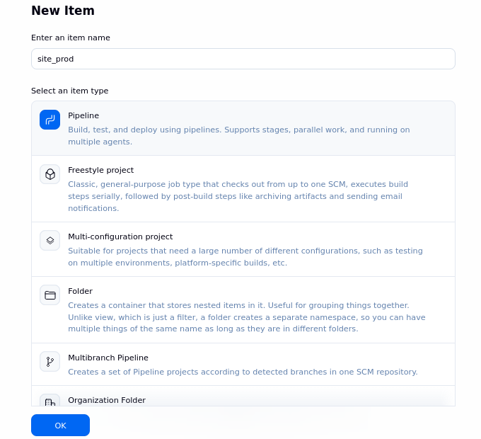
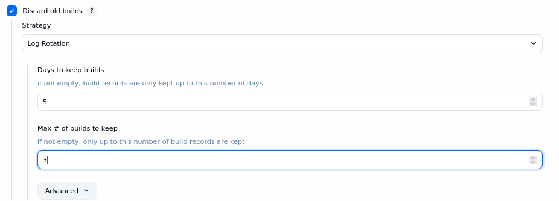
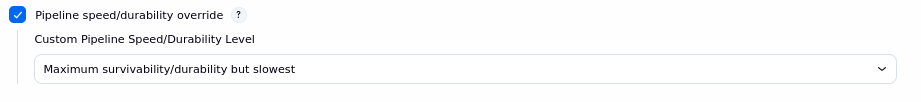
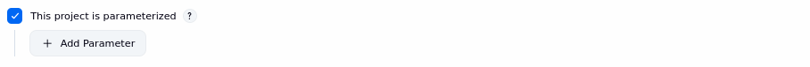
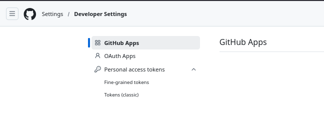
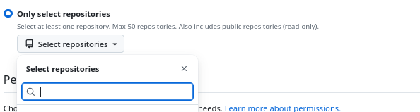
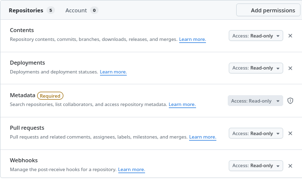

# Step to make a pipeline

### Step 1: Jenkins create pipeline
Create a **New Item** in jenkins and select **pipeline**. Make sure the site name follows \<site-name>_prod just like in the image below.



### Step 2: Options
Select the options are given in the images below

We discard old builds as they may fill up the storage very quick.


Dont allow two build to work together as each step in our pipline destroys the older stuff before building. If there are two builds running in parallel, this will lead to race condition.


Don't restart build from any arbitary step, as this may poison the current build with older data leading to a broken build.


Slow and steady wins the race


Just select this option, we dont need to describe parameters here as we are going to describe them in the script. On first build the default values of parameters will be used.


### Step 3: Script writing
Copy the script from any pervious pipeline (taking [osdag pipeline](../../jenkins/osdag_1_4577.groovy) script as example here) and make following changes, make sure all replacements are global:
1. Replace osdag -> \<site-name> 
2. Unique number (4577) with new 4 digit number, 4577 -> 1234
3. Port number (9101) with new port number 9101 -> 9113. (The port number is 9000 + number of sites deployed, osdag is 9101, arduino is 9102 and so on.)
4. Site repositroy: https://github.com/FOSSEE/osdag_10_docker_image -> actual repo link, only use https here.
5. Change Dockerfile name based on Drupal version as described here. Dockerfile for version 10 and Dockerfile.11 for version 11.
6. Change name of sql dumpfile to match the dumpfile name in repo in next step. (osdag_10.sql) in our example will be replaced with something like sitename_10.sql.
7. Change the mount point of uploads folder as directed by developer.

### Step 4: Create a db repo
Next we need to create a repo where developers can upload the mysql dump file. the repo is named with the format: \<site-name>_db. (This way the above substitution takes care of correct naming.) Here we need to make sure that the developer uploads sql dump with correct file name \<site-name>\_\<drupal version>.sql

### Step 5: Create creds
We need to generate some secrets for jenkins to work properly. Go to Jenkins > Setting > Credentials
1. Create a password for sql user of the site. Each site gets it's own sql user, each user has a unique password. We need to use a strong password which is a combination of alpha-numeric and special characters. We should avoid using bash specific character in this like ! " ' and $. This will be stored in secret text type cred:

1. Go to your github account and create a 'fine grained tokens' if not already created.


1. Select your repository and add to the token.


1. Give the following permissions to the token in read only mode.



### Step 6: Create folders for mounting
Log in to ODIN server and switch to ``root`` user. Go to ``/var/lib/jenkins/site_directories``. Create two folder with names of this format. 
<site-name>_uploads
<site-name>_public

Then grant the following permission to the folders:
```
chown -R jenkins:www-data <site-name>_public
chown -R jenkins:www-data <site-name>_uploads
chmod -R 770 <site-name>_public
chmod -R 770 <site-name>_uploads
```

Then change the seLinux labels:
```
chcon -R system_u:object_r:container_file_t:s0 <site-name>_public
chcon -R system_u:object_r:container_file_t:s0 <site-name>_uploads
```

### Build
Finally build the site. The pipeline will build with default values of parameters. If the deployment fails refert to [this documentation](./Docs_JenkinsAdditional.md#jenkins-troubleshooting)